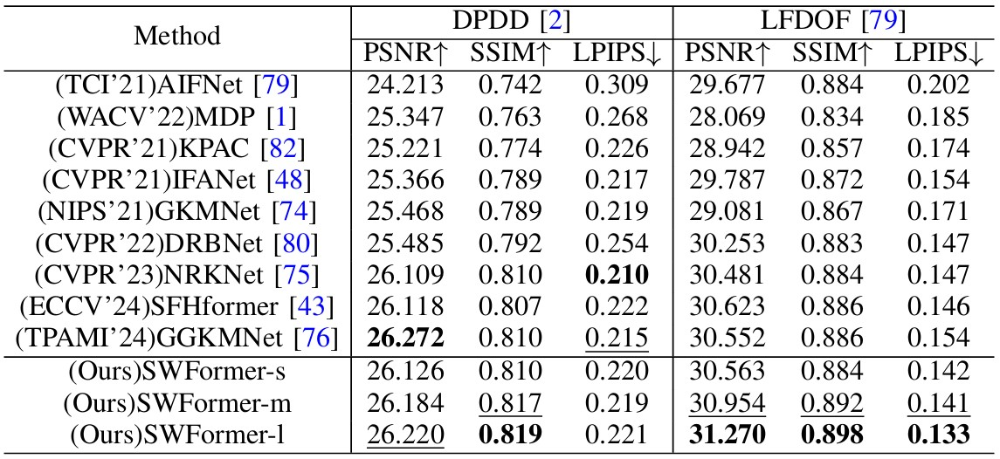

## [Image Restoration via Multi-domain Learning]
 Official implementation.
 
#### News
- **May 17, 2025:** Our paper is available at [https://arxiv.org/pdf/2505.05504](https://arxiv.org/pdf/2505.05504).

> **Abstract:** *Due to adverse atmospheric and imaging conditions, natural images suffer from various degradation phenomena. Consequently, image restoration has emerged as a key solution and garnered substantial attention. Although recent Transformer architectures have demonstrated impressive success across various restoration tasks, their considerable model complexity poses significant challenges for both training and real-time deployment. Furthermore, instead of investigating the commonalities among different degradations, most existing restoration methods focus on modifying Transformer under limited restoration priors. In this work, we first review various degradation phenomena under multi-domain perspective, identifying common priors. Then, we introduce a novel restoration framework, which integrates multi-domain learning into Transformer. Specifically, in Token Mixer, we propose a Spatial-Wavelet-Fourier multi-domain structure that facilitates local-region-global multi-receptive field modeling to replace vanilla self-attention. Additionally, in Feed-Forward Network, we incorporate multi-scale learning to fuse multi-domain features at different resolutions. Comprehensive experimental results across ten restoration tasks, such as dehazing, desnowing, motion deblurring, defocus deblurring, rain streak/raindrop removal, cloud removal, shadow removal, underwater enhancement and low-light enhancement, demonstrate that our proposed model outperforms state-of-the-art methods and achieves a favorable trade-off among restoration performance, parameter size, computational cost and inference latency.* 

## Introduction

 

## Network Architecture

 

## Results
Experiments are performed for different image restoration tasks including, image dehazing, image deraining, image desnowing, image motion deblurring, defocus deblurring, image raindrop removal, shadow removal, cloud removal, low-light image enhancement and underwater image enhancement. 

<strong>Image Dehazing</strong> (click to expand) 

 

<strong>Image Deraining</strong> (click to expand) 

 

<strong>Image Desnowing</strong> (click to expand) 

 

<strong>Cloud Removal</strong> (click to expand) 

 

<strong>Image Raindrop Removal</strong> (click to expand) 

 

<strong>Motion Deblurring</strong> (click to expand) 

<strong>Defocus Deblurring</strong> (click to expand) 

 

<strong>Shadow Removal</strong> (click to expand) 

 

<strong>Underwater Image Enhancement</strong> (click to expand) 

 

<strong>Low-light Image Enhancement</strong> (click to expand) 

 

<strong></strong>Model Performance and Complexity Balance (click to expand) 

 

<strong></strong>Model Performance and Latency Balance (click to expand) 

 

## Prepare Datasets

**Deraining Datasets:** <a href="https://pan.baidu.com/s/1OCaSuwQRgkpm3kU55Hef0Q?pwd=sakm">Rain200L/Rain200H</a> <a href="https://pan.baidu.com/s/1zknuXnv5MR6yhS0I8u2uZg?pwd=h8vv">DDN-Data</a> <a href="https://pan.baidu.com/s/1RsDzu_lS-l2_FxdUnBarOQ?pwd=vxgq">DID-Data Train</a> <a href="https://pan.baidu.com/s/1sJUb6iwxAWOcoBBLn0iuUA?pwd=6bpj">DID-Data Test</a> SPA-Data <a href="https://pan.baidu.com/s/1X9itrS6BRlMp8d_Da8X12Q?pwd=61xr">4K-Rain13k</a> <a href="https://pan.baidu.com/s/1zztcAht2aQje4hHcDnGynQ?pwd=2y7d">Raindrop</a>

**Dehazing Datasets:** <a href="https://pan.baidu.com/s/11Pfl227viFijuw8jmAGcJw?pwd=m82m">ITS</a> OTS <a href="https://pan.baidu.com/s/1e8OG6aNgFSm9SHYQ2pvyuA?pwd=7xwn">O-HAZE</a> <a href="https://pan.baidu.com/s/1seuSmqRUAgC5zGXS9xtxPw?pwd=nyyt">NH-HAZE</a> <a href="https://pan.baidu.com/s/1hjysGvoVatWaY_FrmWeLmQ?pwd=xfu4">DENSE-HAZE</a> <a href="https://pan.baidu.com/s/1mcULooUYzGBRgqaEGFLQ0Q?pwd=779y">SOTS</a> 

**Low-light Enhancement Datasets:** <a href="https://pan.baidu.com/s/1ZF4zAN7TVrj2wXLH9SdbNA?pwd=9cph">LOLv1</a> <a href="https://pan.baidu.com/s/1qmwGK2MT1rRZqsiChQi7AA?pwd=ujep">LOLv2</a> 

**Motion Deblur Datasets:** <a href="https://pan.baidu.com/s/1ANXeNVc-sySlqgpOSaq9vQ?pwd=c5jc">Motion Blur(GoPro/HIDE)</a>

**Defocus Deblur Datasets:** <a href="https://pan.baidu.com/s/1x1PPGvtmPpsxLBZtsT0cMA?pwd=ttj8">DPDD</a> <a href="https://pan.baidu.com/s/1IWBMWmAXEqDqLEzMSqPwBQ?pwd=mpif">LFDOF</a>

**Desnowing Datasets:** <a href="https://pan.baidu.com/s/1iUC3Y5Wn_rpy4P48x5hpVQ?pwd=352s">CSD</a> <a href="https://pan.baidu.com/s/14bGq_pvpUXv1k1wWJqZs4g?pwd=vcda">SRRS</a> <a href="https://pan.baidu.com/s/1TjR1VIn6MIqAD7UjguAmqg?pwd=4wi3">Snow100K</a> 

**Underwater Enhancement Datasets:** <a href="https://pan.baidu.com/s/1V2tSOFkUmPIVPCAgxu5dBA?pwd=r6tf">UIEB</a> <a href="https://pan.baidu.com/s/1R_vzgn927IEu0vUAubWI-w?pwd=w3u7">LSUI</a>

**Shadow Datasets:** AITSD

**Cloud Datasets:** CUHK-CR

## Visual Results

## References

Here is the BibTeX citation for the paper:

    @article{jiang2025image,
      title={Image Restoration via Multi-domain Learning},
      author={Jiang, Xingyu and Gao, Ning and Zhang, Xiuhui and Dou, Hongkun and Fu, Shaowen and Zhong, Xiaoqing and Li, Hongjue and Deng, Yue},
      journal={arXiv preprint arXiv:2505.05504},
      year={2025}
    }

## Contact

If your submitted issue has not been noticed or there are further questions, please contact jxy33zrhd@buaa.edu.cn.
